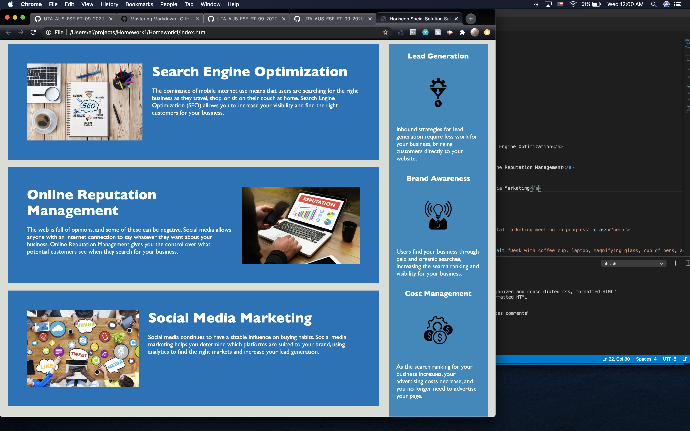
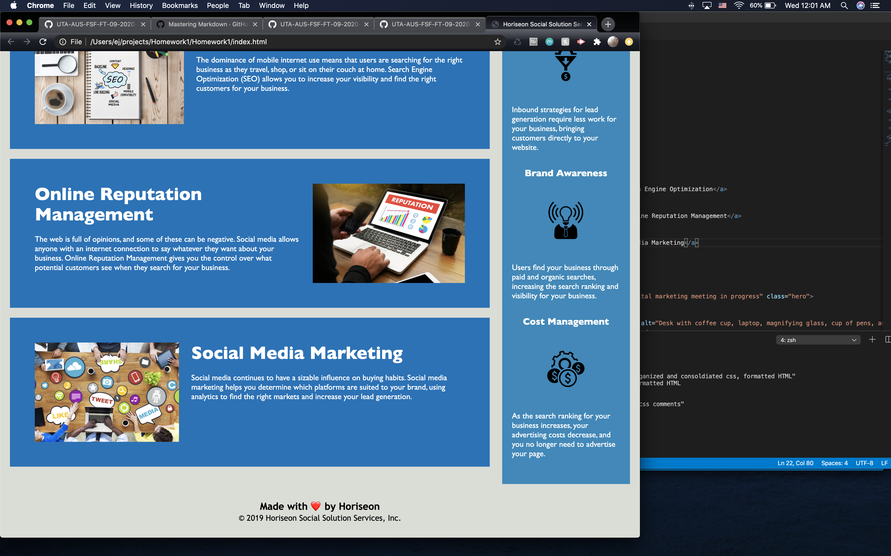

# Homework1
I've did this project in order for the given code to be more accessible by adding alt tags to images and making sure the language is semantic by adding header, section, aside, and footer tags.
I reorganized and consolidated the CSS so that it was also semantic. I also added comments so the consolidation makes sense.
I've included a [link to page](https://ejkennelly.github.io/Homework1/) as well as 3 screenshots.

.
